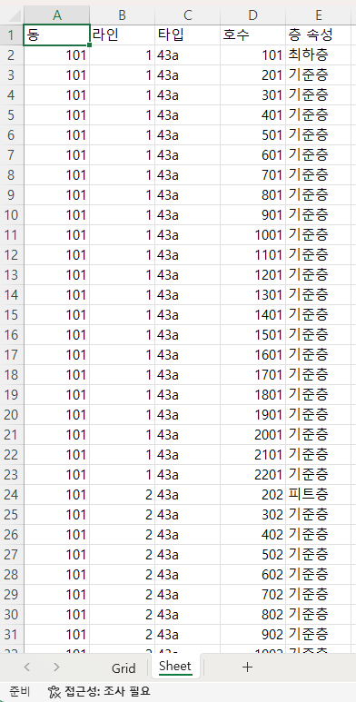
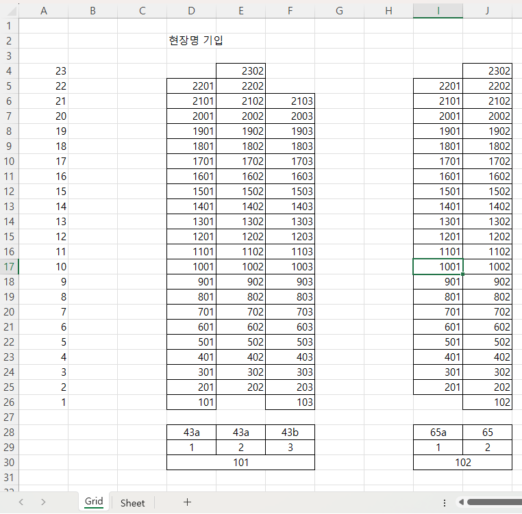

# 📌Building Grid_to_Excel
건설사에서 배포하는 **배치도**를 엑셀로 제작하기 위한 파이썬 코드를 구현하였습니다.


**[건설사 배치도 예시 이미지]**
<p float="left">
    
    <p> [DataSheet] & [GridSheet]
    <br>
    
    
</p>

## 🪄 Stack
- 기간 : 2024.09.26 (목) ~
- Tool : Python (pycharm 사용)


## 📝Getting Started

### 📎Code Structure

```aiignore

main.py
│
├── get_building_data() 
│   └── input : 동 
│        └── input : type, line, 최상층, 최하층
├── create_nested_data()
├── create_grid_layout()
├── save_to_excel()
│   
└── ** def main **
```


### Installation
```
pip install openpyxl
pip install pandas (생략 가능)
```

## Start
### ▶️ 실행버튼 클릭

입력
```aiignore
e.g.)
동을 입력하세요 (종료하려면 0 입력): 101
타입을 입력하세요 (해당 동 종료 시, end 입력): 84A
라인을 입력하세요: 1
최상층을 입력하세요: 17
최하층을 입력하세요: 1
타입을 입력하세요 (해당 동 종료 시, end 입력): 84A
라인을 입력하세요: 2
최상층을 입력하세요: 22
최하층을 입력하세요: 2
타입을 입력하세요 (해당 동 종료 시, end 입력): end
동을 입력하세요 (종료하려면 0 입력): 0
```

💾 Excel Save 
```
Data saved to building_room_dataaaa.xlsx
저장하고자하는 최종 파일명을 입력하세요 : {저장하고자하는 파일이름}
현장명을 입력하세요: {현장명 작성}
```
📨 완료 메시지
```aiignore
Final layout saved to save_to_excel/{저장하고자하는 파일이름}.xlsx
```
